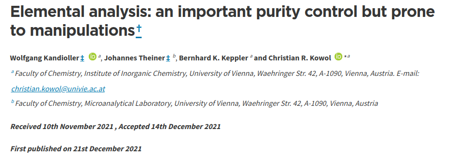

```{r setup, include=FALSE}
knitr::opts_chunk$set(echo = FALSE)
```


## Integrated lab solutions {data-background=figures/integratedlabsolutions.jpg data-background-size=cover}

<div style="text-align:right">
 <font size="2.5">
    Photo by <a href="https://unsplash.com/@alexkondratiev?utm_source=unsplash&utm_medium=referral&utm_content=creditCopyText">Alex Kondratiev</a> on <a href="https://unsplash.com/s/photos/lab?utm_source=unsplash&utm_medium=referral&utm_content=creditCopyText">Unsplash</a>
 </font>
</div>
  
## Modern lab requirements {.build}

 - High throughput of samples
 - Multiple parameters
 - Many (partly-)automatized techniques
 - Software and computer systems
 - Multifaceted and large data streams
 
*A 2020 study of my own: atomic absorption spectroscopy, atomic emission spectroscopy, mass spectrometry, scanning electron microscopy, spectrophotometry, energy-dispersive X-ray spectroscopy, elemental analyser, and high-sensitive balance*

## {data-background=figures/Miller-Urey-experiment.jpg}

## {data-background=figures/EVO-Helios_Pano2.jpg}

## Taking command of lab-data {.build}

<div style="float: left; width: 20%;">
{width=100%}
</div>

<div style="float: right; width: 20%;">
{width=100%}
</div>

</br>
</br>

- Default commercial software (Cameca, Zeiss, Thermo Fisher)
- Prevent tracking data from source to publication
- Long-term storage and accessibility throughout the data life-cycle 
- Monitoring and troubleshooting is reduced to current analysis

</br>

<div class="centered">
  <font size="15">
    **Vendor lock-in**  
  </font>
</div>


<div class="notes">
- 4: So, on does not take advantage of the multiple types (organics, stable isotopes, ...) of analysis taking place over time (.g. for precision : reproducibility)
</div>

## {data-background=figures/dataflow.png data-background-size=cover}

## {data-background=figures/dataflow1.png data-background-size=cover}

## {data-background=figures/dataflow2.png data-background-size=cover}

## {data-background=figures/dataflow3.png data-background-size=cover}


## Opening-up the black box of lab-data

- GUI based dashboards, wizards and dialogs that hide (part) of the transformations and calculations taking place
- The reviewer that wants to trace back the origin of data
- Old/defunct machinery

<div class="centered">
  {width=90%}
</div>

<div class="notes">
  add 1: Why rely solely on the manufacturers data handling and quality checks. Of course this does not mean that we should now all distrust the manufacturers but it would sometime be good to let a fresh mind have a look at how data is handled.
  add 2: Sometimes also reviewer want (or should) check the final to-be published results, and then we need easy access to the original data
  add3: These are also interesting cases. For once sometimes perfectly functioning set-ups don't have an software support anymore. This means that sometimes labs are running legacy operating systems just to be able to run the machine's software. Then there are also vast piles of relic data - data which could be of perfectly fine quality - that are not easily accessible. 
</div>


## Is more data better?

- New innovations
- Inclusive science
- More transparent science (proof of final published values)


<div class="centered">
  
</div>

<div style="text-align:center">
  <font size="2.5">
  <a href="https://xkcd.com/2582/">xkcd.com</a>
  </font>
</div>


<div class="notes">
  The "vendor lock-in" results in situations where we don't actually know how we get to the values that we use in our research.
  
</div>


## {data-background=figures/unconnected-lab.png}

## {data-background=figures/integrated-lab.png}

## The integrated lab

- Data collecting and harmonization
  - Parsing of unstructured data
  - Data normalization (SQL-like)
- Modular processing, analysis, and diagnostics suite
  - Count statistics, spectral analysis, regression, ...
- Online monitoring
  - Dashboards of the lab's long-term reproducibility
  - Troubleshooting
  
<div class="notes">
  add 2: I have not studied this in detail, but there are probably a lot of commonalities between data reduction protocols of divergent machines (manufacturer but also type of machine). As such one can distill this to only a handful of tools (count data, spectral analysis, regression)
</div>

## The integrated lab

- Data collecting and harmonization
  - Parsing of unstructured data
  - Data normalization (SQL-like)
<font color="lightgrey">  
- Modular processing, analysis, and diagnostics suite
  - Count statistics, spectral analysis, regression, ...
- Online monitoring
  - Dashboards of the lab's long-term reproducibility
  - Troubleshooting

</font>
  
## Data collecting and harmonization {.build}

**Custom solutions**

- Deciphering the vendor's data-model is labor intensive
  - Multiple files
  - Many observations
  - Inconsistent syntax
  - Unstructured
- Accommodate vendor's software/data-model updates

</br>
</br>

<div class="centered">
  <font size="15">
    **An universal solution?**  
  </font>
</div>

## Parsing lab-data

Text data (encoded or decoded)

```{r input, out.width="90%", fig.cap="Unstructured raw data files from analytical laboratory", echo=FALSE}

```

## Provisional solutions

Three possible solutions, which require varying degrees of human intervention:

1. A mechanism to aid the location of variables based on user input
2. A human-crafted (and adaptable) rule based system
3. A natural language processing approach involving self-supervised machine learning

The last two solutions would be preceded by a step entailing text normalization through tokenization.

<div class="notes">
  add 1: requires the input of variable names and their context (i.e., a table or line), whereby regular expression locate the respective variables for subsequent parsing. This approach would thus require considerable knowledge of the end-user considering the raw data and its internal organization.
  add 2: Tokenization will be performed with cascades of regular expressions for word (entity) delimiters. These delimiters will likely not be based on word boundaries, but instead use a combination of punctuation and tabs as delimiters. On the other hand, special character and alphanumeric combinations, as occur in paths and dates, should constitute one token, and require special consideration.
  add 3: This method could be reminiscent of part-of-speech tagging in order to recognize the individual entities of the triplet; variables, values, and units. Recognition of larger structures (i.e, tables) might be based on chunking approaches that reminisce the methods serving context free grammar and/or dependency grammar solutions in NLP.
</div>


## Provisional solutions

</br>

```{r solutions, echo=FALSE}
sols <- tibble::tibble(
  Solutions = c("\\#1", "\\#3", "\\#3"),
  `Human-action` = c("high", "medium", "low"),
  Risk = c("low", "medium", "high")
) 
kableExtra::kable(sols, escape = FALSE ) |>  kableExtra::kable_classic_2() 
```

## iRODS and user accesibility

Integration with iRODS

  - Sub-system for automated ingest
  - Automated workflows
  - Better collaboration
  
Accessibility

  - Interfaces for R and Python (standalone usage)

<div class="centered"> 
{width=30%}


<div style="text-align:center">
 <font size="2.5">
    Evan-Amos, 2011. A SanDisk Cruzer USB drive from 2011, with 4 GB of storage capacity <a href="https://en.wikipedia.org/wiki/USB_flash_drive#/media/File:SanDisk-Cruzer-USB-4GB-ThumbDrive.jpg">Wikipedia</a>
 </font>
</div>
## Implementation

<div style="float: left; width: 10%;">
{width=100%}
</div>

<div style="float: right; width: 10%;">
{width=100%}
</div>

</br>
</br>
</br>

***panacea***: Portable ANalytical data Aggregation and Coordination for database Entry and Access

- C++ for optimal performance with large datasets
- R and python bindings for user-friendliness and standalone usage

**auxiliary**

- Updating *rirods* (*irods/irods_client_library_r_cpp*) to work with iRODS from R
- Restrictive and complex system requirements not ideal for R and C++ integration


## Roadmap {data-background=figures/roadmap.png data-background-size=cover}


## Short-term goals

**Address the vendor lock-in of lab-data with panacea** 

1. New software updates of the vendor-supplied software that impact the output format can be more easily accommodated
2. Data formats from defunct software and vendors can be more conveniently analysed and/or archived
3. The integration of (meta)data from different sources can aid online monitoring of lab performance

## Long-term goals

The integrated lab will foster:

  - more efficient labs and innovations
  - better open science practices
  - inclusive science

Stimulate a push in the industry of lab equipment towards open sourced software solutions

## Thanks

iRODS consortium

- Johan Renaudie (MfN Berlin)
- Terrell Russell (iRODS)

## FAIReLABS

**Help us!**
https://fairelabs.github.io/webpage/

<iframe src="https://fairelabs.github.io/webpage/" scrolling="yes"></iframe>


